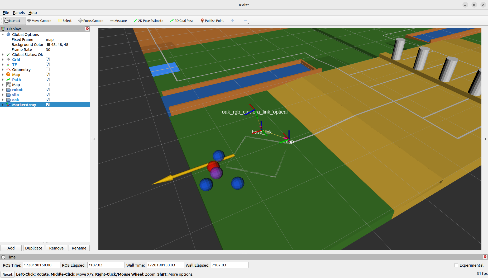

# Computer Vision codebase for ABU Robocon-2024 Automatic Robot | Part I: Determine Destination for Robot Navigation

## About Official Contest

For this year's theme, it was necessary to build an automatic robot that can **navigate to pick up Rice Grains** (representation of selecting good paddy rice among bad ones). In the Zone 3, there would be ***Empty Grain (Purple Color)*** and ***Rice Grain : Team Color (Red or Blue)***. Automatic robot needed to pick up Rice Grain and store them in vessels & the scoring was done on the basis of which team stored more grains. 

### References
  [Contest Website](https://aburobocon2024.vtv.gov.vn/)  
  [Theme video](https://www.youtube.com/watch?v=zavE1DzyH6Q)

## Introduction

This is a ROS2 humble python package. It uses depth camera (OAKD Pro-W) to get the aligned RGB and depth frame. The RGB frame is published to a topic and YOLOv8-ROS detects Empty Grain and Rice Grain. Then using the location of bounding box of Rice Grain obtains their location in gamefield using the depth-map published by OAKD camera. And, the nearest Rice Grain as per robot's position is set as target. Then, the goalpose(destination) is calculated as per proper offset considering robot's dimensions and the target location. The goalpose is continuously published continuously at 20Hz and updated depending upon the inference time of YOLOv8 model.

<div style="text-align: center;">
  
  <p style="text-align: center; font-size: 1.2em;">Fig: Object detection to distinguish Rice and Empty Grain</p>
</div>

<div style="text-align: center;">
  
  <p style="text-align: center; font-size: 1.2em;">Fig: Goalpose and Detections visualized in RVIZ2</p>
</div>

## Requirements

### Hardware
1. [OAKD Pro-W Camera](https://shop.luxonis.com/products/oak-d-pro-w?variant=43715946447071)
2. **Optional:** A machine with **discrete GPU** (for quick model inference & real time performance)

### Development Environment & ROS2 necessities
1. Ubuntu 22.04 LTS Jammy Jellyfish (as ROS2 Humble is supported here)
2. [ROS2 humble desktop](https://docs.ros.org/en/humble/Installation.html)
3. [colcon](https://docs.ros.org/en/humble/Tutorials/Beginner-Client-Libraries/Colcon-Tutorial.html) - to build ROS2 packages
4. [rosdep](https://docs.ros.org/en/humble/Tutorials/Intermediate/Rosdep.html) - to manage dependencies
3. [YOLOv8-ROS package](https://github.com/tyro-apil/yolov8_ros)
4. **map -> base_link** transform in TF_tree
5. **map -> base_link** transform as [Odometry msg](https://docs.ros2.org/foxy/api/nav_msgs/msg/Odometry.html) in **"/odometry/filtered"** topic
6. An accurate estimation of **base_link -> oak_rgb_cameralink_optical** transform in the config file **config/base2cam.yaml**
7. Custom ROS2 messages: [oakd_msgs](https://github.com/tyro-apil/oakd_msgs)
8. **Optional:** Gamefield URDF published in RVIZ2

### Python packages
1. ***depthai*** - for interfacing OAKD camera
2. ***opencv*** - for image processing
3. ***scipy*** - for representing Rotation (Orientation) of robot & destination as well as easy conversion from Euler Angles to Quaternion
4. ***numpy*** - for matrix operations


## How to use this package

### Building ROS2 packages

    | Change the config files in the config directory as per necessity.

1. Put the required packages mentioned above in same workspace i.e. inside ***src*** directory. Then, install dependencies using rosdep. Dependencies can be seen in **package.xml** and it can be installed manually.

    ```
    sudo rosdep init
    rosdep update
    ```
    ```
    rosdep install --from-paths src -y --ignore-src
    ```

2. Using colcon build packages from the workspace directory using symlink (so that changes in codebase is directly implemented without rebuilding (not in C++))
    ```
    colcon build --symlink-install
    ```

### Running the package

1. Source the installed files
    ```
    source install/setup.bash
    ```

2. Run this high level python launch file to run all the nodes
    ```
    ros2 launch oakd oakd.launch.py
    ```

  If you want to run individual nodes, you can run them as per their name in **setup.py**. Also, you can launch individual launch file for grouped functionality as per their name in **launch** directory.  
  [Guide for running nodes from CLI](https://docs.ros.org/en/humble/How-To-Guides/Node-arguments.html)  
  [Launch file tutorials](https://docs.ros.org/en/humble/Tutorials/Intermediate/Launch/Launch-Main.html)

  
